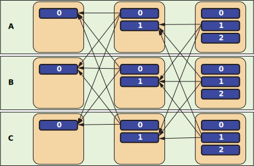

之前[SUI区块链](https://sui.io/)刚出的时候，我就解读过 SUI 使用的[高效共识算法的论文](https://arxiv.org/abs/2105.11827)。可惜，因为忘记续费VPS，弄丢了唯一的一份存档。

SUI使用的是Narwhal Mempool和Tusk共识协议。这是一种典型的利用DAG（有向无环图）结构实现的高效共识算法。其实早在SUI之前，Hedera就使用了DAG来实现高效共识算法，所以这种算法倒也不算什么新鲜产物。而且，区块链讲究资历。虽然SUI的性能比Hedera要高，而且Hedera基本就是一个公链竞赛的遗留产物；但是，SUI的价格走势很难让人不认为它是诈骗币或者跑路币，而且OKX交易所开放SUI之初，出现了系统错误，让投机客们都对SUI畏而远之，这就导致SUI「出生入死」。

SUI用的DAG Rider那套其实不止适用于区块链领域，就像Diffusion模型不止适用于图像生成领域一样。所以，抛开专门用于区块链的那部分，我简单说一说DAG Rider是怎么回事以及能做什么。

## DAG Rider 是什么发明？

论文原文在[arxiv](https://arxiv.org/abs/2105.11827)，需要的自己去看。

论文第一句话说，DAG Rider是**the first** asynchronous Byzantine Atomic Broadcast protocol（异步拜占庭原子广播协议）。

拜占庭容错性我想了解过一点区块链或者分布式计算的读者应该比较熟悉，就算不熟悉，应该也听说过拜占庭将军问题。而异步和原子性我想不需要多说，分别是数据库的基本概念和编程常见概念。

回归到拜占庭将军问题，拜占庭将军们分别各率领一支军队共同围困一座城市的背景。DAG Rider所要解决的问题是这样的：

+ 将军们需要攻打一个城市，为此需要通过信使远程协商**一系列**战术。因为显然不是广播一次就结束了，所以这里和拜占庭问题原来的只需要确定一次战术（进攻和撤退）不同。
+ 各个将军随时可以独自行动，不需要等其他人一起行动。这是**异步性**。
+ 要么所有忠诚将军都获得相同的战术指令，要么都没有获得战术指令。不存在一部分人收到而另一部分人没有受到的情况。这是**原子性**。
+ 即使有叛徒将军，也能获得一致决策。这是**拜占庭容错性**。

## 有向无环图做了什么

DAG Rider分为两层，一个是通信层，一个是无开销排序层。

### 通信层的DAG

在通信层，广播过程可靠地传输元数据，以形成DAG。具体来说，是在一次又一次的传输中，形成一个由有$O(n)$个先前消息引用的信息组成的DAG（$n$为传播的轮数）。

为什么是DAG呢？为什么能保证没有环呢？而且通信层DAG到底是什么组成的？

如下图所示

每一个黄色的方框就是一个消息，每个消息都有先前消息的引用，这些引用用带箭头的蓝色方框表示。把所有消息像这样铺开，就能发现，因为同一轮之间没有引用，所以必定是无环的。

每一个绿色的框就是一个参与广播的成员，或者说，一个忠诚的将军。这里暂时先不考虑异常的成员。

从左到右每一列都表示一轮广播。

### 通信层DAG的每个节点是怎么产生的

其实DAG Rider这里并没有要求节点产生的方式是什么，只是定义了数据结构，顺便给定了一些显然需要的性质。

（未完成）