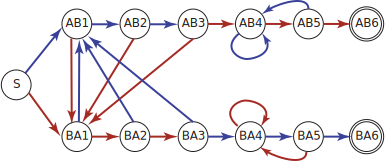

前几天，遇到了这样的一个问题

> 投1000次硬币，连续出现5次正面且连续出现5次反面的结果种类是多少

这个问题有多种解法，最简单且可以泛化的思路是：转换为「求正则表达式可匹配的输入数」

一个显然的结论是，如果把正面记作1，反面记作0，那么符合条件的正则表达式可以描述为

`````javascript
\(.*0{5}.*1{5}.*)|(.*1{5}.*0{5}.*)\
`````

## 从正则表达式到邻接矩阵

众所周知，正则表达式等价于一个确定状态有限自动机。而一个确定状态有限自动机有它的转换图。这个转换图是有向图。

并且，由图论，在有向无权图中，邻接矩阵的$$n$$次幂的第$$i$$行第$$j$$列元素的值（$$\mathbf{A}_{i,j}^n$$）表示从顶点$$i$$到顶点$$j$$恰好通过$$n$$条边的不同路径的数量。简单来说，这个值告诉你在图中从顶点$$i$$到顶点$$j$$有多少种不同的方式可以通过恰好$$n$$步到达。每一步都对应图中的一条有向边。

那么，我们就可以求所有起点到结束状态的方式（即$$\mathbf{A}_{i,j}^n$$）从而求出长度为$$n$$的正则表达式可匹配的输入数。

## 原题的DFA状态转换图

通常来说，将正则表达式转换为DFA需要的步骤有

1. 使用Thompson构造算法，你可以从正则表达式创建一个NFA。这个NFA将能够接受相同的语言。在这个步骤中，每个正则表达式操作（如连接、选择和重复）都对应于NFA中特定的状态和转换。
2. 使用子集构造算法（也称为Powerset构造算法），你可以将NFA转换为等价的DFA。在这个过程中，DFA的每个状态都代表原始NFA中状态的一个集合。DFA中的转换根据NFA的转换和状态集合确定。
3. 使用例如Hopcroft算法，你可以最小化DFA，去除不必要的状态，使得DFA变得更简洁高效。

不过，一般来说高中题目不会需要那么复杂的步骤，凭感觉直接写出DFA往往也是可行的。比如，原题的DFA如下图所示（省略为连续3次）



图中，蓝色表示接受1，红色表示接受0。AB代表先5个1后5个0，BA代表先5个0后5个1。因为省略，图中只画出了连续3个的情况，不过连续5个是类似的。

将5次扩展到$$m$$次之后，对应的有向图的邻接矩阵（DFA转换矩阵）是

(Promise\)

对于比较小的矩阵，可以采用对角化的方式。而对于这种比较大的矩阵，更好的做法是直接计算某项的乘积，尝试找递推关系。

对于这道题，我们只需要关注$$\mathbf{A}_{3m+3,1}^n+\mathbf{A}_{4m+3,1}^n$$即可。

展开，得
$$
\begin{align}
f(n) = 
\mathbf{A}_{3m+3,1}^n& +\mathbf{A}_{4m+3,1}^n \\
 &= \sum_{i=1}^{4m+3}\left( \mathbf{A}^{n-1}_{3m+3,i} \cdot \mathbf{A}^{n-1}_{i,1}  + \mathbf{A}^{n-1}_{4m+3,i}\cdot\mathbf{A}^{n-1}_{i,1}\right)\\
 &= \sum_{i=1}^{4m+3}\mathbf{A}^{n-1}_{i,1}\left(\mathbf{A}^{n-1}_{3m+3,i} +\mathbf{A}^{n-1}_{4m+3,i} \right)
\end{align}
$$
(Promise\<latex\>)

> 未完成计算